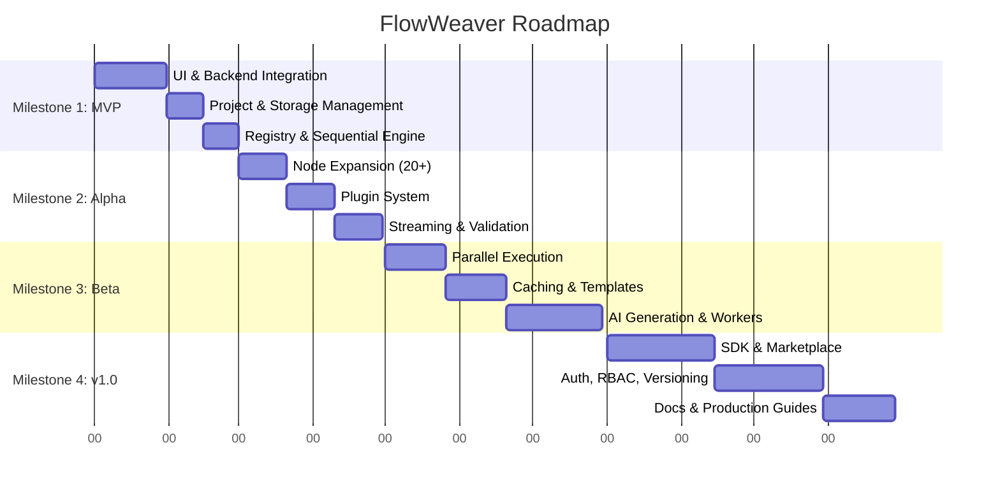

# FlowWeaver Project Roadmap

This document outlines the strategic roadmap for FlowWeaver, a visual pipeline builder. It details our planned milestones from MVP through to the v1.0 stable release.

## Overview

*(Dates in the Gantt chart are illustrative, representing the monthly progression described below.)*

---

## Milestone 1 — MVP (Month 1-2)

The goal of the MVP is to transition from a pure frontend simulation to a functional full-stack application capable of executing simple, linear data processing pipelines.

**Deliverables**
- UI connected to backend REST API.
- Project management capabilities (Create, List, Edit, Delete).
- Save and load pipelines to a persistent database (e.g., SQLite or Postgres).
- Basic node registry integration on the backend.
- Sequential execution engine supporting basic data passing between nodes.
- A fully working end-to-end example: CSV Loader → Normalize → Export.

**Success Criteria**
- A user can create a pipeline, configure nodes, save it, and run it successfully.
- Data successfully flows from the CSV node to the Export node.

**Dependencies**
- Finalization of the API Contract (Phase 7).
- Selection of backend tech stack (e.g., Node.js/Python).

**Risks**
- **Data Serialization:** Moving data efficiently between nodes in memory vs on disk during execution.

---

## Milestone 2 — Alpha (Month 3-4)

The Alpha phase focuses on expanding capabilities, improving the developer experience for adding nodes, and giving users better visibility into pipeline executions.

**Deliverables**
- Expansion of built-in nodes (20+ standard nodes across Loaders, Filters, Transforms).
- Plugin loading system architecture (ability to dynamically load new node definitions).
- Streaming execution updates via WebSockets.
- Detailed execution logs and history retention.
- Dataset preview functionality in the UI (viewing samples of data at node boundaries).
- Pre-execution pipeline validation (cycle detection, required schema checks).

**Success Criteria**
- Users can view real-time progress of running pipelines.
- Users can inspect the output data of intermediate nodes.
- Developers can write and load a simple custom node plugin.

**Dependencies**
- Milestone 1 backend stability.
- WebSocket infrastructure implementation.

**Risks**
- **UI Performance:** Handling high-frequency WebSocket events for streaming logs and status updates without crashing the React UI.

---

## Milestone 3 — Beta (Month 5-7)

Beta is about scaling execution, improving productivity, and preparing the architecture for enterprise use cases.

**Deliverables**
- Parallel execution engine (running independent branches of a DAG simultaneously).
- Caching and checkpoints (skip re-running nodes if inputs/config haven't changed).
- Pipeline templates system (save as template, instantiate from template).
- AI-assisted pipeline generation (text-to-pipeline).
- Team collaboration basics (shared workspaces).
- Worker system for long-running jobs (separating API server from execution workers).

**Success Criteria**
- A complex DAG executes faster due to parallelization.
- Re-running a failed pipeline only executes from the point of failure (thanks to checkpoints).
- Users can successfully generate a starter pipeline using an AI prompt.

**Dependencies**
- Task queue infrastructure (e.g., Redis + Celery/BullMQ) for the worker system.

**Risks**
- **State Management:** Accurately invalidating caches when node configurations change.
- **Complexity:** Parallel execution engine debugging is significantly harder than sequential.

---

## Milestone 4 — v1.0 (Month 8-12)

The 1.0 release is focused on stability, security, extensibility, and community building.

**Deliverables**
- Stable Plugin SDK with strong typing and test harnesses.
- Plugin marketplace / registry for community contributions.
- Distributed workers (scaling out execution across multiple machines).
- Authentication and Role-Based Access Control (RBAC).
- Pipeline versioning (commit history for pipelines).
- Comprehensive production deployment guides (Helm charts, Docker Compose).
- Complete user and developer documentation.

**Success Criteria**
- FlowWeaver can be deployed securely in a production Kubernetes cluster.
- A 3rd party developer can publish a plugin and another user can install it.
- Multiple users can collaborate securely with different permission levels.

**Dependencies**
- Stable beta release.
- Thorough security audit.

**Risks**
- **API Churn:** Locking in the Plugin SDK means breaking changes must be strictly managed.
- **Security:** Distributed execution of arbitrary code (plugins) requires strong sandboxing or trusted environments.
