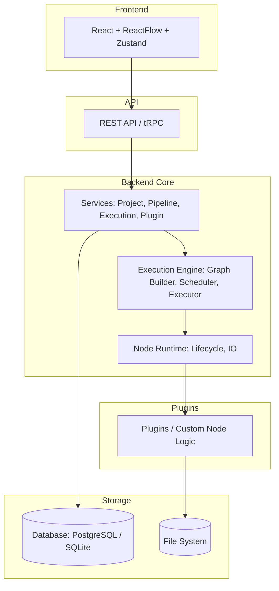
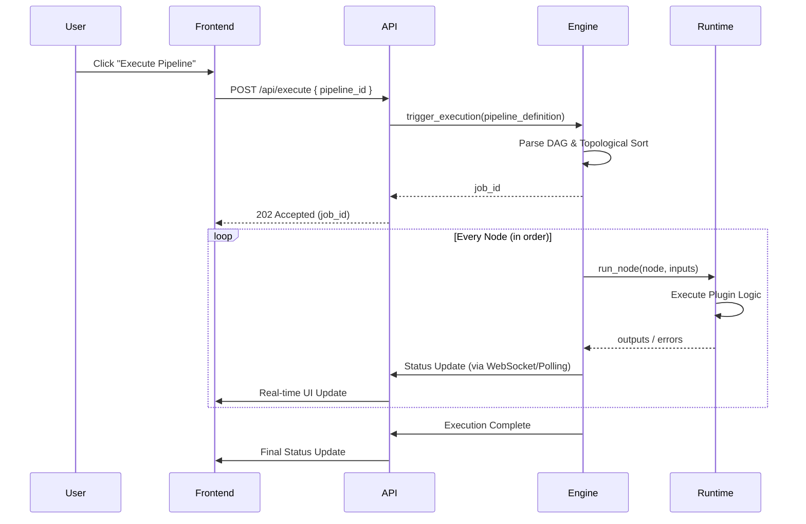
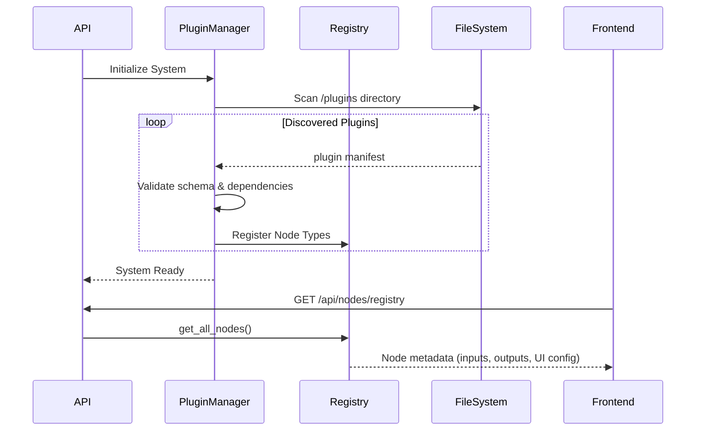
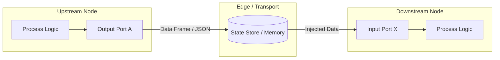

# Phase 2 Architecture Document: FlowWeaver

## 1. Overview
This document outlines the target architecture for FlowWeaver, a visual pipeline builder. It describes the layered system design, detailing responsibilities, interfaces, dependencies, and key design decisions for each layer. It also covers the current and target states, migration plan, repository structure, and technology recommendations.

## 2. System Architecture

The target architecture is a layered, modular system designed for extensibility and performance.



## 3. Architecture Layers

### 3.1. Frontend (React + ReactFlow + Zustand)
- **Responsibilities**: Provide a responsive, interactive visual node-based editor. Manage client-side state, undo/redo, copy/paste, and handle user interactions (node placement, edge connection, parameter configuration).
- **Interfaces**: REST/WebSocket clients for backend communication. Exposes a React tree connected to a global Zustand store.
- **Dependencies**: React 19, ReactFlow 11, Zustand 5, TailwindCSS 4, TanStack Router.
- **Key Design Decisions**: Use Zustand for lightweight, predictable global state management, mapping directly to ReactFlow's node/edge paradigms.

### 3.2. API Layer (FastAPI / tRPC)
- **Responsibilities**: Serve as the gateway between the frontend and the core services. Handle authentication, authorization, request validation, and API routing.
- **Interfaces**: RESTful endpoints and/or tRPC procedures (e.g., `/api/v1/pipelines`, `/api/v1/execute`). WebSockets for real-time execution logs.
- **Dependencies**: Frontend (as consumer), Backend Services (as producer).
- **Key Design Decisions**: Use strong typing (e.g., Pydantic or Zod) to ensure contract consistency between frontend and backend.

### 3.3. Services (Project, Pipeline, Execution, Plugin management)
- **Responsibilities**: Encapsulate core business logic. Manage pipeline CRUD operations, user projects, trigger executions, and discover/load available plugins.
- **Interfaces**: Internal service APIs called by the API Layer.
- **Dependencies**: Storage (DB/FS), Execution Engine, Plugins.
- **Key Design Decisions**: Isolate business logic from transport layer. Use a repository pattern to abstract database interactions.

### 3.4. Execution Engine (Graph builder, Topological sort, Scheduler, Executor)
- **Responsibilities**: Convert a visual pipeline JSON representation into an executable Directed Acyclic Graph (DAG). Validate cycles, resolve execution order (topological sort), and schedule node execution (parallel or sequential).
- **Interfaces**: `execute_pipeline(pipeline_id, parameters)` returning an execution job ID and status stream.
- **Dependencies**: Node Runtime, Services.
- **Key Design Decisions**: Engine should be decoupled from specific node implementations. Focus strictly on orchestration and DAG traversal.

### 3.5. Node Runtime (Node lifecycle, Input/Output handling)
- **Responsibilities**: Provide an isolated environment to execute a specific node's logic. Handle passing data from upstream outputs to downstream inputs, error capturing, and logging.
- **Interfaces**: `run_node(node_definition, inputs, context)` returning `outputs` or throwing handled errors.
- **Dependencies**: Plugins (for node definitions).
- **Key Design Decisions**: Standardize input/output contracts (e.g., data frames, strings, JSON objects) to ensure interoperability between disparate nodes.

### 3.6. Plugins (Node definitions, Custom logic)
- **Responsibilities**: Define the actual processing logic for nodes (e.g., LLM prompts, database queries, text transformations). Define input schemas and output schemas.
- **Interfaces**: Must conform to the `PluginSDK` or `NodeInterface` provided by the platform.
- **Dependencies**: Node SDK.
- **Key Design Decisions**: Load plugins dynamically. Keep them sandboxed if possible to prevent a bad plugin from crashing the execution engine.

### 3.7. Storage (SQLite/PostgreSQL, File system)
- **Responsibilities**: Persist pipeline definitions, user data, plugin configurations, execution history, and large binary blobs (file system/S3).
- **Interfaces**: SQL driver interfaces, File I/O.
- **Dependencies**: None.
- **Key Design Decisions**: Use SQLite for local/desktop usage and PostgreSQL for enterprise/server deployments using a unified ORM.

## 4. Current State vs Target State

### Current State
- **Architecture**: Frontend-only architecture.
- **Execution**: Simulated execution using mock data entirely within the browser.
- **Storage**: Browser local storage / in-memory store.
- **Tech Stack**: React 19, ReactFlow 11, Zustand 5, TailwindCSS 4, TanStack Router, Vite 8. Connected to Lovable.

### Target State
- **Architecture**: Full-stack modular monorepo.
- **Execution**: Robust backend Execution Engine capable of running complex DAGs with actual data processing.
- **Storage**: Persistent relational database (PostgreSQL/SQLite) with file storage for artifacts.
- **Extensibility**: True plugin system allowing third-party developers to author and distribute nodes.

## 5. Migration Plan

1. **Phase 1: Repository Restructuring**: Transition the current Vite React app into a monorepo structure (e.g., using Turborepo or Nx). Create the foundational packages (`shared-types`).
2. **Phase 2: Backend Scaffold**: Implement the API Layer and Storage Layer. Migrate pipeline saving/loading from browser storage to the backend.
3. **Phase 3: Execution Engine Core**: Build the DAG parser, topological sort, and Node Runtime in the backend.
4. **Phase 4: Core Plugins Migration**: Migrate the existing mock node logic into backend plugins.
5. **Phase 5: Full Integration**: Wire the frontend execution triggers to the backend engine. Implement WebSockets for real-time execution feedback.

## 6. Monorepo Structure

```text
flow-weaver/
├── apps/
│   ├── web/                 # React frontend (current src/)
│   └── api/                 # Backend API (FastAPI or Node.js)
├── packages/
│   ├── execution-engine/    # Core DAG execution logic
│   ├── node-sdk/            # SDK for building nodes
│   ├── plugin-sdk/          # SDK for building plugins
│   ├── shared-types/        # Shared TypeScript types / Zod schemas
│   └── ui-components/       # Shared UI components
├── plugins/
│   ├── core/                # Built-in core nodes (loaders, filters)
│   ├── text/                # Text processing nodes
│   ├── nlp/                 # NLP nodes
│   └── data/                # Data manipulation nodes
├── docs/                    # Architecture and developer documentation
├── examples/                # Example pipelines
├── tests/                   # E2E and integration tests
├── scripts/                 # Build and migration scripts
└── docker/                  # Dockerfiles and compose setups
```

## 7. Technology Recommendations

| Component | Recommendation | Rationale |
|-----------|----------------|-----------|
| **Frontend** | React, ReactFlow, Zustand, Tailwind | Proven, high-performance ecosystem for visual node editors. Already in use. |
| **Backend API** | FastAPI (Python) or tRPC/Express (Node) | **Python**: Better for AI/NLP/Data processing ecosystem. **Node.js**: Better for full-stack TS code sharing. Recommend **FastAPI** given the likely NLP/Data focus of pipelines. |
| **Monorepo Tool** | Turborepo | Excellent TypeScript support, fast caching, easy to configure. |
| **Database** | PostgreSQL + Prisma/SQLAlchemy | Strong relational modeling for pipelines and executions. |
| **Validation** | Zod (TS) / Pydantic (Python) | strict, composable schema validation that can generate API docs (OpenAPI). |

## 8. Flows & Diagrams

### Execution Flow



### Plugin Loading Flow



### Data Flow Between Nodes



## 9. Deployment Architecture

```mermaid
flowchart TD
    Client[Web Browser] -->|HTTPS| CDN[CDN / Load Balancer]
    CDN -->|Static Assets| S3[Object Storage]
    CDN -->|API / WS| App[Backend Container (API + Engine)]
    
    subgraph Cloud Environment
        App --> DB[(PostgreSQL)]
        App --> Redis[(Redis Cache / PubSub)]
        App --> Storage[(Volume / Blob Storage)]
    end
```
