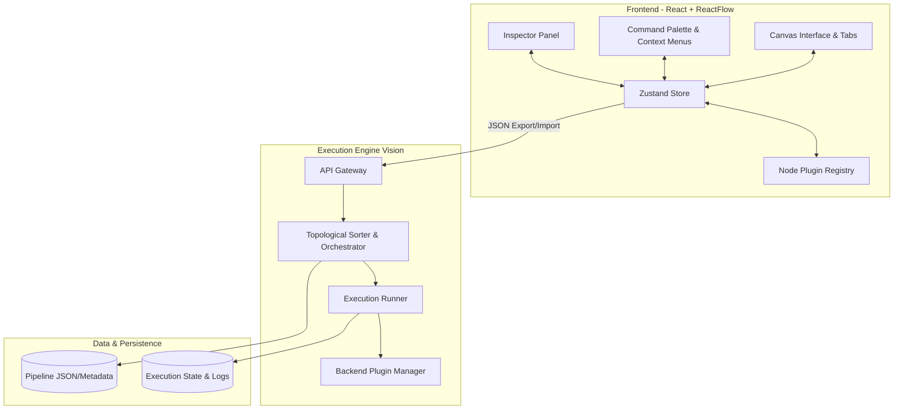

# FlowWeaver Design Vision

## The Problem
Data orchestration and processing pipelines are often rigid, opaque, and inaccessible to non-engineers. Code-first solutions require deep programming knowledge, while traditional visual ETL tools are often closed-ecosystem, expensive, and inflexible. Building, debugging, and maintaining complex data transformations—from standard data wrangling to modern NLP and ML pipelines—remains fraught with friction.

FlowWeaver solves this by providing a modern, extensible, visual pipeline builder that bridges the gap between data engineering and business logic. It combines the intuitive canvas experience of node-based interfaces (like Apache NiFi or n8n) with a modern web stack (React Flow), making complex data workflows transparent, modular, and easy to construct.

## Who is it for?
- **Data Engineers & Analysts:** To rapidly prototype, build, and debug data pipelines without writing boilerplate code.
- **AI/ML Practitioners:** To orchestrate data prep, embedding generation, text tokenization, and NLP workflows seamlessly.
- **Product Teams:** To create and manage internal data workflows visually, empowering stakeholders to understand and tweak business rules.
- **Platform Developers:** To build custom plugins and extend the ecosystem via a rich registry pattern.

## What is NOT in Scope?
- **Replacing Code-First Distributed Frameworks:** FlowWeaver orchestrates and transforms data but is not a replacement for bare-metal coding against big data frameworks (like Spark or Flink) when programmatic constraints are required.
- **General Purpose App Building:** It is not a no-code UI builder for general software development. It focuses specifically on data and processing pipelines.
- **Closed Ecosystem:** FlowWeaver will not lock users into proprietary node types or vendor-specific integrations.

## Core Principles

1. **Everything is a Node**
   Every operation—from loading a CSV, filtering rows, performing fuzzy deduplication, generating embeddings, to webhook exports—is a node. This unifies the conceptual model, making pipelines intuitive to reason about and build visually on the canvas.

2. **Everything is a Plugin**
   The core platform is agnostic to the actual processing logic. Every node type is an independent plugin that registers its typed ports (tabular, text, image, audio, any), configuration parameters, and execution logic. This ensures the platform can scale boundlessly through first-party and community contributions.

3. **Everything Streams**
   Modern data pipelines cannot always wait for giant batch jobs to finish before processing the next step. FlowWeaver's execution architecture is designed with streaming in mind—moving data between nodes efficiently to minimize memory footprints and enable near real-time processing capabilities.

4. **Everything is Versioned**
   Pipelines are critical infrastructure. Every change on the canvas, every node configuration, and every pipeline state is trackable and versionable. This design naturally supports features like undo/redo, copy/paste, multi-tab workspaces, and robust save/load capabilities via JSON.

5. **Everything is Inspectable**
   Debugging data pipelines shouldn't require guessing. Every node provides rich inspector panels, mock output previews, and detailed state visualization (like color labels and comments). You can observe the data as it flows between connections, making the state of any pipeline transparent.

6. **Everything is Reproducible**
   A pipeline should behave deterministically. By capturing the exact state, dependencies, and parameters of the node graph, FlowWeaver ensures that running a pipeline yields consistent results, empowering confident simulation and eventual production execution.

## High-Level Architecture Vision

The following diagram illustrates the architectural vision for FlowWeaver as it evolves from a client-side simulated builder to a full-stack execution platform.

This north star guides FlowWeaver's development, ensuring a scalable, intuitive, and powerful visual processing platform.
